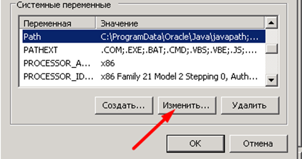
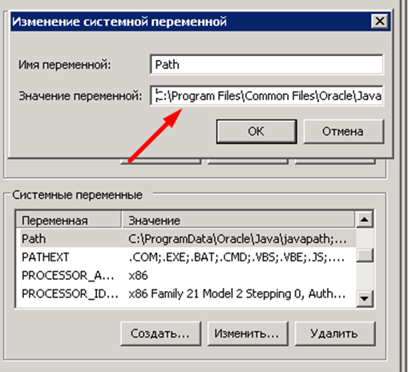
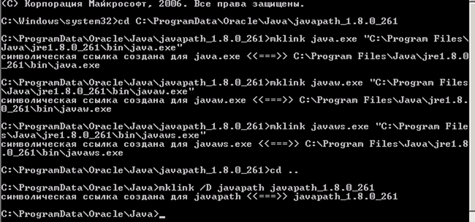
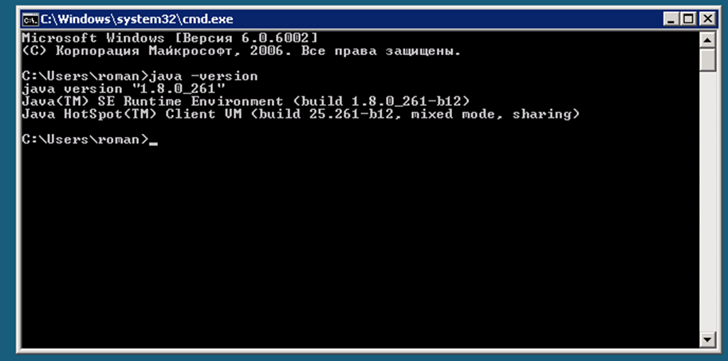
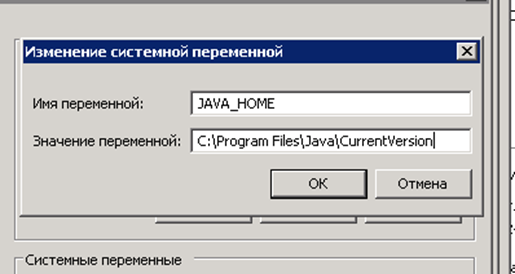
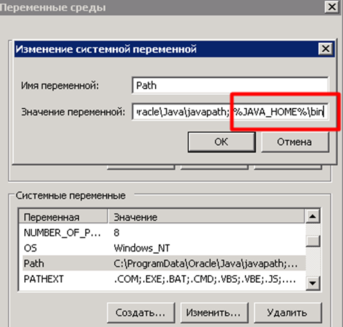
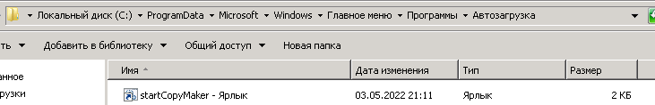

# Автономное копирование истории браузера
Эта программа создает резервную копию истории Google Chrome или Firefox для каждого из пользователей. 
В дальнейшем происходит анализ, подсчёт числа ссылок, которые содержат определенную строку.
Это необходимо для контроля оплаты открытых резюме работниками (HR отдел) на hh.ru. 

# Как работает программа

Программа запускается, как только пользователь открывает рабочий стол.
В указанной папке создаётся папка `/ResultHistory`, в которую складываются файлы истории каждого из пользователей по дням.
Обновление файла истории происходит раз в 30 секунд. Считывается полная история указанного браузера за текущий день (с 00:00:00),
из полученного набора данных вычитаем записи истории, что хранятся в текстовом файле, таким образом, будут добавлены только новые строки.

# Установка и запуск

## Установка JAVA (change runtime environment, on Windows 8 Server for example)
> Важно! Перед запуском программы необходимо убедиться, что на компьютере установлена JAVA 8 (jre 8). 

### Как загрузить и установить java 8. Смена java runtime environment.
1) Скачать файл установки с официального сайта, версия jre-8u261-windows-i586: https://www.oracle.com/java/technologies/javase/javase8u211-later-archive-downloads.html#license-lightbox 
2) Нажать правой кнопкой мыши на скачанный файл (Файл находится в папке “Загрузка”), выбрать «Запуск от имени администратора», появится окно установки, нажать на checkbox (соглашение с правилами Java), нажать “Next”. После установки закрыть окно установщика. 
3) Убедиться, что по пути C:\Program Files\Java появилась папка jre1.8.0_261 
4) Зайти в Панель управления-> Система-> Дополнительные параметры системы-> Переменные среды найти в «Системные переменные» переменную Path, один раз нажать на нее, нажать кнопку ниже «Изменить»

   Стереть “C:\Program Files\Common Files\Oracle\Java\javapath;”:

5) В проводнике открыть путь C:\ProgramData\Oracle\Java и создать папку javapathjre1.8.0_261. Удалить папку javapath (если такая папка будет существовать) 
6) * Открыть командную строку с правами администратора (правая кнопка мыши -> «Запуск от имени администратора»).
   * Скопировать следующий путь: C:\ProgramData\Oracle\Java\javapathjre1.8.0_261
   * Исполнить команды, как на скриншоте:

Строки для исполнения:
```cmd
cd C:\ProgramData\Oracle\Java\javapathjre1.8.0_261 	
mklink java.exe "C:\Program Files\Java\jre1.8.0_261\bin\java.exe" 	
mklink javaw.exe "C:\Program Files\Java\jre1.8.0_261\bin\javaw.exe" 	
mklink javaws.exe "C:\Program Files\Java\jre1.8.0_261\bin\javaws.exe"
```

8) Подняться на один уровень вверх и создать символьную ссылку на javapath с помощью следующих команд: 	
```cmd
cd ..
mklink /D javapath javapathjre1.8.0_261
```

9) Закрыть командную строку. Открыть пуск, в поиске найти «Выполнить», написать внутри поиска «regedit», нажать “enter”, откроется новое окно, в этом окне найти слева папку 
   HKEY_LOCAL_MACHINE\SOFTWARE\JavaSoft\Java Runtime Environment\CurrentVersion и убедиться, что CurrentVersion имеет значение 1.8, закрыть. 
10) Скачать драйвер по ссылке https://www.microsoft.com/ru-ru/download/details.aspx?id=48145.
    Установить скачанный драйвер С++ vc_redist.x86 (правая кнопка мыши -> "Установить как администратор")
11) Проверить, что Java установлена, открыть командную строку, ввести команду «java -version»:

12) Открыть командную строку от имени администратора(как в пункте 2), в командной строке ввести  
```cmd
cd C:\Program Files\Java\ 
mklink /D CurrentVersion .\jre1.8.0_261
```

13) зайти в панель управления-> система->  дополнительные параметры систмы->переменные среды, нажать в Системных меременных «создать», в открывшемся окне: имя - JAVA_HOME, 
    значение - C:\Program Files\Java\CurrentVersion

    
    Найти переменную Path, изменить, добавить в конец: %JAVA_HOME%\bin


## Как запустить программу
1)	Создать папку, например, testHistory (или другое название) в C:\Users\Public (общая папка), где хотим разместить программу.
2)	В пути C:\Users\Public\testHistory создать папку execCopy – здесь будет храниться программа копирования истории.
3)	Файл HistoryCopyMaker-1.0-SNAPSHOT.jar поместить в C:\Users\Public\testHistory\execCopy, так же внутри создать `startCopyMaker.bat` файл(для запуска программы), который содержит:
```shell
start javaw -jar HistoryCopyMaker-1.0-SNAPSHOT.jar <path_to_working_directory> <config_path>
```
    path_to_working_directory - абсолютный путь до созданной папки, например C:/Users/Public/<created_folder>
    config_path - абсолютный путь до файла конфигурации (главное, чтобы он был виден всем пользователям), например C:\Users\Public\<any_folders>\config.json

example:
```shell 
start javaw -jar HistoryCopyMaker-1.0-SNAPSHOT.jar "C:/Users/Public/createdFolderForProgram" "C:\Users\Public\createdFolderForProgram\config\config_example.json"
```

4) Создать файл формата ".json", описание:
   username - имя пользователя
   browserType - тип браузера "chrome" или "firefox" (по умолчанию, "chrome", если указать значение "null" или если не указывать ключ "browserType")
   logging - включение логирования в файл C:/Users/Public/<created_folder>/log/<username>_copyMaker.log. Принимаемые значения true или false. Чтобы включить нужно передать true (если указать false или не указывать ключ "logging" - логирование будет выключено).
   path - абсолютный путь до файла истории браузера, указывать в двойных кавычках (Значения по умолчанию(если указать "", null или совсем не указывать ключ "path"): для "Mozilla" "C:\Users\<username>\AppData\Roaming\Mozilla\Firefox\Profiles\*.default-esr\places.sqlite". Для Chrome "C:\Users\<username>\AppData\Local\Google\Chrome\User Data\Default\History")

5) Создать ярлык файла `startCopyMaker.bat` (правая кнопка мыши – создать ярлык). Поместить созданный ярлык в папку `C:\ProgramData\Microsoft\Windows\Start Menu\Programs\Startup` (навести курсор, зажать левую кнопку мыши и перенести в "Автозагрузки"):
      


# Вспомогательные ссылки:
1)	https://stackoverflow.com/questions/3333553/how-can-i-change-the-java-runtime-version-on-windows-7
2)	https://www.oracle.com/java/technologies/javase/javase8u211-later-archive-downloads.html#license-lightbox
